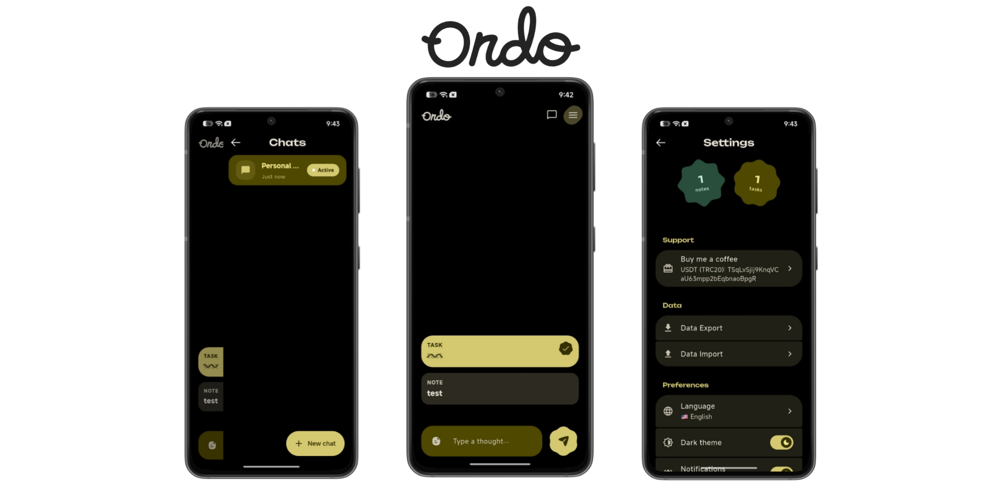
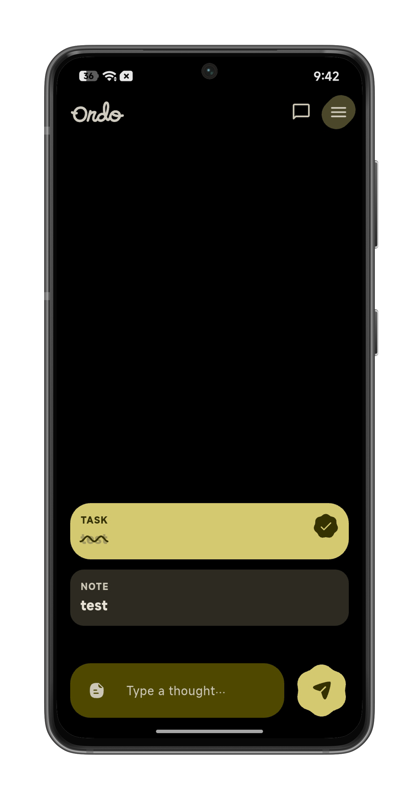
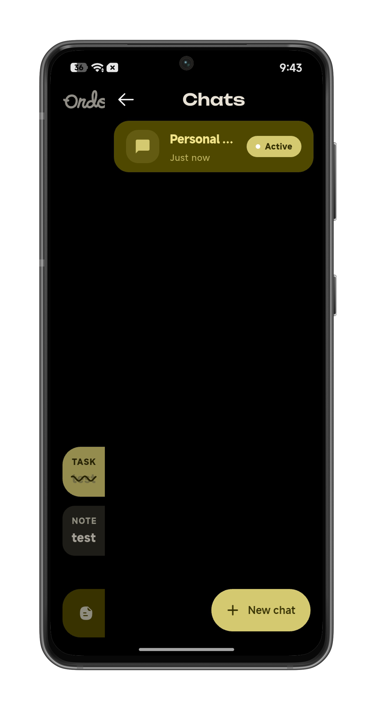
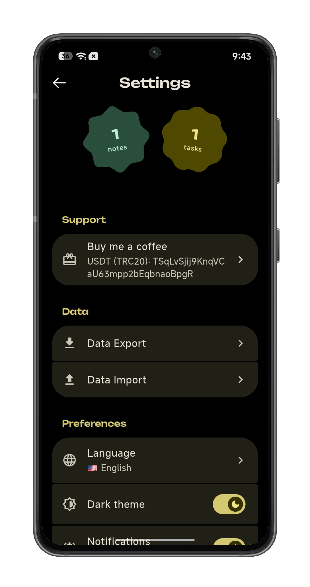

# ordo

A premium chat-based notes & tasks application built with Flutter.

<p align="center">
  
</p>

## Screenshots

<p align="center">
  
  
  
</p>

## Features

- **Notes & Tasks** — write thoughts, manage to-dos, set reminders
- **Chat interface** — natural conversation-style interaction
- **Multi-language** — supports 15+ languages with automatic system locale detection
- **Theming** — dynamic color, AMOLED mode, dark/light themes
- **Data export/import** — backup and restore your data
- **Notifications** — task reminders and alerts

## Supported Languages

🇺🇸 English · 🇱🇾 العربية · 🇷🇺 Русский · 🇰🇷 한국어 · 🇮🇷 فارسی · 🇪🇸 Español · 🇮🇩 Bahasa Indonesia · 🇻🇳 Tiếng Việt · 🇨🇳 中文 · 🇲🇽 Español (MX) · 🇧🇷 Português (BR) · 🇵🇭 Filipino · 🇵🇰 اردو · 🇱🇰 සිංහල · 🇵🇱 Polski

## Getting Started

```bash
flutter pub get
flutter run
```

### Build for platforms

```bash
# Android (release with split APKs per ABI)
flutter build apk --release --split-per-abi --tree-shake-icons

# Other platforms
flutter build ios
flutter build linux
flutter build macos
flutter build windows
flutter build web
```

## Tech Stack

- **Framework:** Flutter (Dart)
- **Design:** Material 3 Expressive (M3E) — dynamic color, custom theming
- **State management:** flutter_bloc
- **Local database:** drift (SQLite)
- **Localization:** Custom AppLocalizations
- **Notifications:** flutter_local_notifications

## Special Thanks

The M3E (Material 3 Expressive) design system components used in this project are from [Bunpod](https://github.com/kamranbekirovyz/bunpod) — an open-source Flutter design system by Kamran Bekirov.

- [expressive_sheet](packages/expressive_sheet/)
- [expressive_snack](packages/expressive_snack/)
- [expressive_loading_indicator](packages/expressive_loading_indicator/)
- [material_shapes](packages/material_shapes/)
- [material_wavy_progress_indicator](packages/material_wavy_progress_indicator/)

## License

MIT License — see [LICENSE](LICENSE) for details.

## Community

Join the Telegram group for updates, support, and feedback:

<p align="center">
  <a href="https://t.me/ordosk5">
    
  </a>
</p>

## Support

If you find this project helpful, consider supporting the developer.

<p align="center">
  
</p>

**USDT (TRC-20):** `TSqLvSjij9KnqVCaU63mpp2bEqbnaoBpgR`

<p align="center">
  <a href="https://link.trustwallet.com/send?coin=195&address=TSqLvSjij9KnqVCaU63mpp2bEqbnaoBpgR&token_id=TR7NHqjeKQxGTCi8q8ZY4pL8otSzgjLj6t">
    
  </a>
</p>
